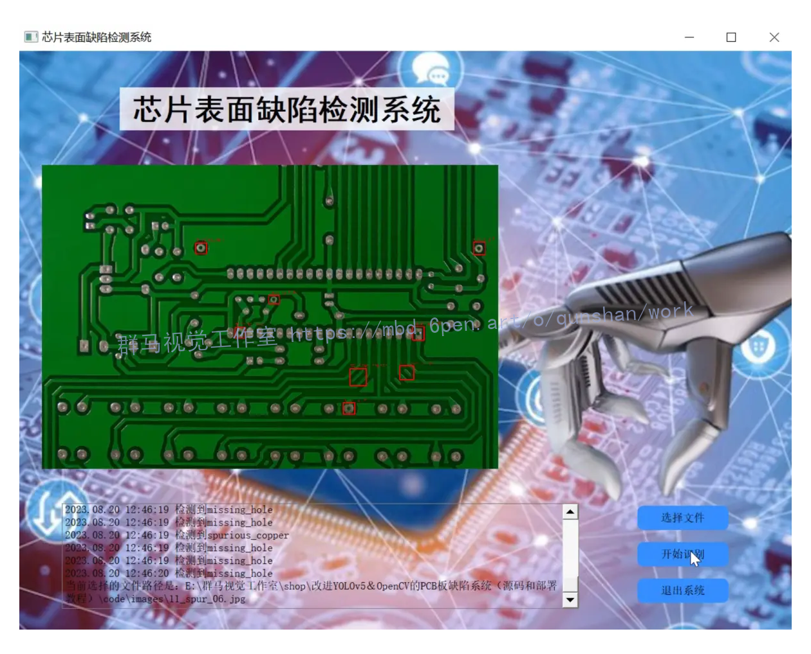
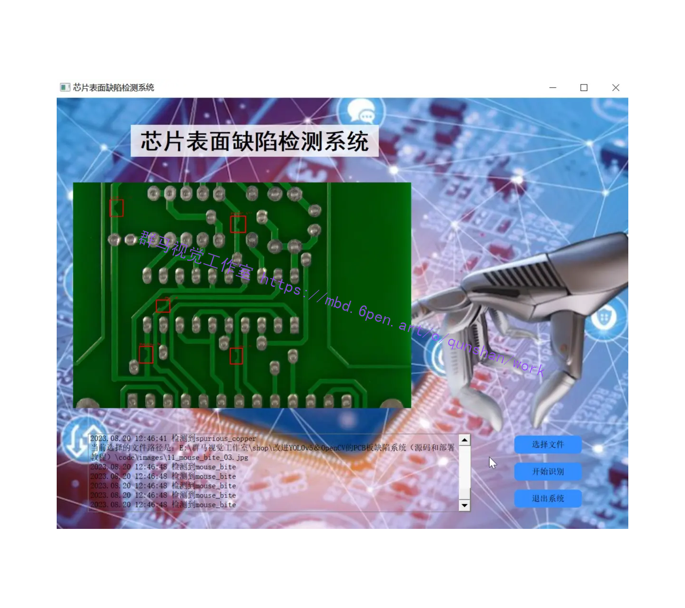
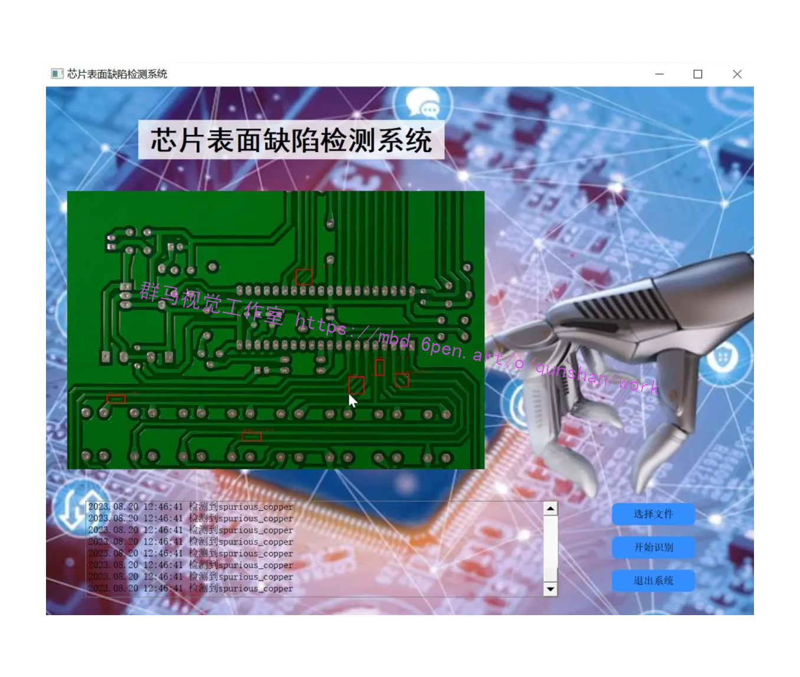
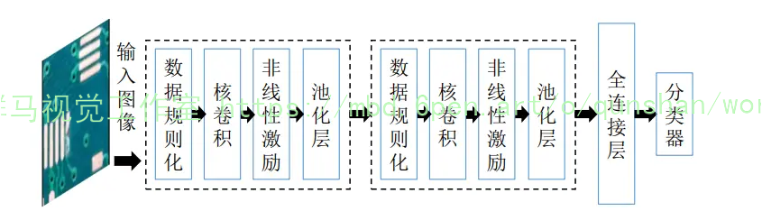
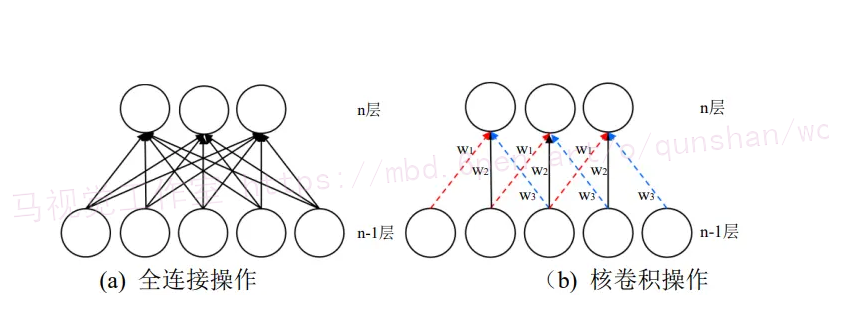
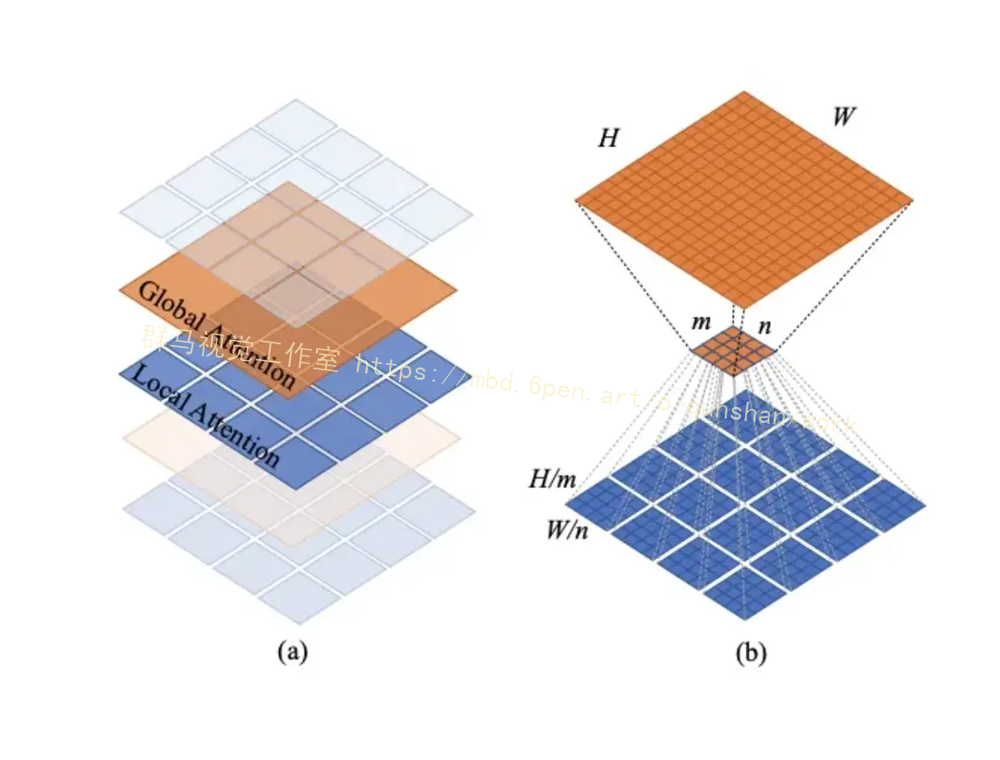
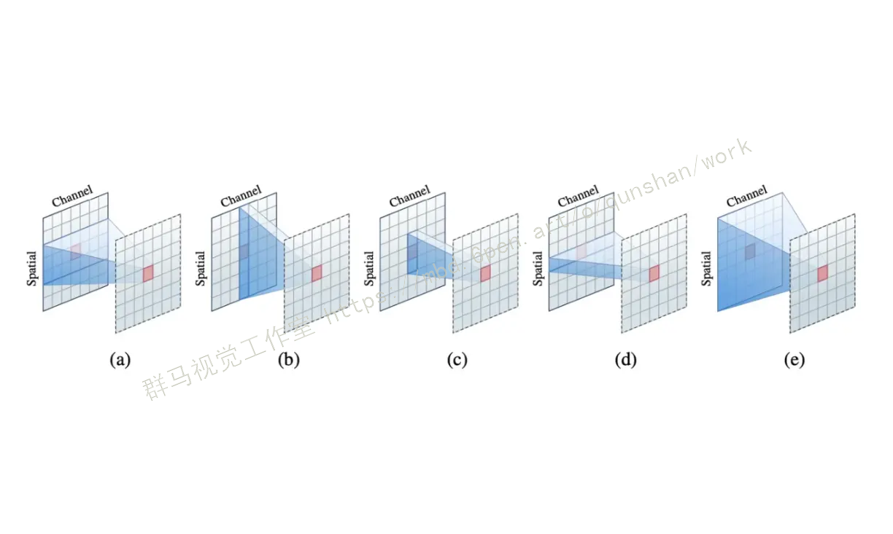
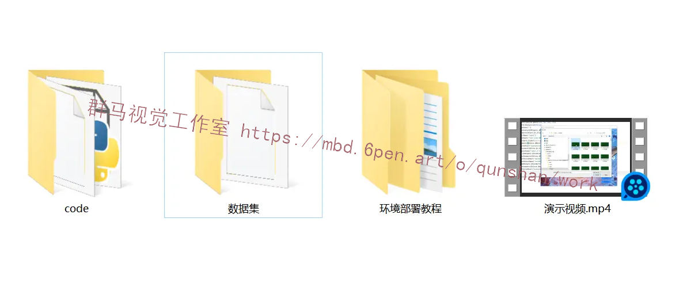



## 1.研究背景


随着电子产品的普及和应用范围的扩大，印刷电路板（Printed Circuit Board，PCB）作为电子产品的核心组成部分，其质量和可靠性对整个产品的性能和寿命起着至关重要的作用。然而，在PCB的制造过程中，由于材料、设备、工艺等因素的影响，往往会导致一些缺陷的产生，如焊接不良、线路断裂、短路等。这些缺陷不仅会影响产品的正常工作，还可能导致产品的损坏甚至危及用户的安全。

因此，对PCB板的缺陷进行准确、高效的检测和识别是至关重要的。传统的PCB板缺陷检测方法主要依赖于人工目视检查，这种方法存在着效率低、易出错、主观性强等问题。而随着计算机视觉和深度学习技术的快速发展，基于YOLOv5和OpenCV的PCB板缺陷系统应运而生。

YOLOv5是一种基于深度学习的目标检测算法，其具有高效、准确、实时性强等优点。通过训练一个深度神经网络，YOLOv5可以实现对PCB板上各种缺陷的自动检测和识别。而OpenCV是一个开源的计算机视觉库，提供了丰富的图像处理和分析功能，可以用于对PCB板图像进行预处理和后处理。

## 2.研究意义：

1. 提高检测效率和准确性：相比传统的人工目视检查方法，基于YOLOv5和OpenCV的系统可以实现对PCB板缺陷的自动检测和识别，大大提高了检测的效率和准确性。同时，由于YOLOv5具有实时性强的特点，可以实时监测PCB板的生产过程，及时发现和修复缺陷，提高了产品的质量和可靠性。

2. 降低成本和提高生产效率：传统的人工目视检查方法需要大量的人力和时间投入，成本高且效率低下。而基于YOLOv5和OpenCV的系统可以实现自动化检测，减少了人力投入和检测时间，降低了成本，提高了生产效率。

3. 推动计算机视觉和深度学习技术的应用：基于YOLOv5和OpenCV的PCB板缺陷系统是计算机视觉和深度学习技术在电子制造领域的典型应用。通过该系统的研究和应用，可以推动计算机视觉和深度学习技术在其他领域的应用，促进技术的进步和创新。

总之，基于YOLOv5和OpenCV的PCB板缺陷系统具有重要的研究意义和实际应用价值。通过该系统的研究和应用，可以提高PCB板缺陷的检测效率和准确性，降低成本，提高生产效率，推动计算机视觉和深度学习技术的应用。这对于提高电子产品的质量和可靠性，促进电子制造业的发展具有重要的意义。

# 3.图片演示






# 4.视频演示
[改进YOLOv5＆OpenCV的PCB板缺陷检测系统（源码和部署教程）_哔哩哔哩_bilibili](https://www.bilibili.com/video/BV1mG411f7eE/?vd_source=ff015de2d29cbe2a9cdbfa7064407a08)


## 5.核心代码讲解

#### 5.1 ui.py

```python


def load_model(
        weights='./best.pt',  # model.pt path(s)
        data=ROOT / 'data/coco128.yaml',  # dataset.yaml path
        device='',  # cuda device, i.e. 0 or 0,1,2,3 or cpu
        half=False,  # use FP16 half-precision inference
        dnn=False,  # use OpenCV DNN for ONNX inference

):
    # Load model
    device = select_device(device)
    model = DetectMultiBackend(weights, device=device, dnn=dnn, data=data)
    stride, names, pt, jit, onnx, engine = model.stride, model.names, model.pt, model.jit, model.onnx, model.engine

    # Half
    half &= (pt or jit or onnx or engine) and device.type != 'cpu'  # FP16 supported on limited backends with CUDA
    if pt or jit:
        model.model.half() if half else model.model.float()
    return model, stride, names, pt, jit, onnx, engine


def run(model, img, stride, pt,
        imgsz=(640, 640),  # inference size (height, width)
        conf_thres=0.15,  # confidence threshold
        iou_thres=0.15,  # NMS IOU threshold
        max_det=1000,  # maximum detections per image
        device='',  # cuda device, i.e. 0 or 0,1,2,3 or cpu
        classes=None,  # filter by class: --class 0, or --class 0 2 3
        agnostic_nms=False,  # class-agnostic NMS
        augment=False,  # augmented inference
        half=False,  # use FP16 half-precision inference
        ):

    cal_detect = []

    device = select_device(device)
    names = model.module.names if hasattr(model, 'module') else model.names  # get class names

    # Set Dataloader
    im = letterbox(img, imgsz, stride, pt)[0]

    # Convert
    im = im.transpose((2, 0, 1))[::-1]  # HWC to CHW, BGR to RGB
    im = np.ascontiguousarray(im)

    im = torch.from_numpy(im).to(device)
    im = im.half() if half else im.float()  # uint8 to fp16/32
    im /= 255  # 0 - 255 to 0.0 - 1.0
    if len(im.shape) == 3:
        im = im[None]  # expand for batch dim

    pred = model(im, augment=augment)

    pred = non_max_suppression(pred, conf_thres, iou_thres, classes, agnostic_nms, max_det=max_det)
    # Process detections
    for i, det in enumerate(pred):  # detections per image
        if len(det):
            # Rescale boxes from img_size to im0 size
            det[:, :4] = scale_coords(im.shape[2:], det[:, :4], img.shape).round()

            # Write results

            for *xyxy, conf, cls in reversed(det):
                c = int(cls)  # integer class
                label = f'{names[c]}'
                lbl = names[int(cls)]
                print(lbl)
                #if lbl not in [' Chef clothes',' clothes']:
                    #continue
                cal_detect.append([label, xyxy,str(float(conf))[:5]])
    return cal_detect


```

该程序文件是一个基于YOLOv5的芯片表面缺陷检测系统。主要功能包括加载模型、运行模型进行目标检测、显示检测结果。

程序文件首先导入了一系列的库和模块，包括argparse、platform、shutil、time、numpy、cv2、torch等。然后定义了一些全局变量和函数。

load_model函数用于加载模型，参数包括模型权重路径、数据集配置文件路径、设备类型等。该函数会返回加载的模型、步长、类别名称等信息。

run函数用于运行模型进行目标检测，参数包括模型、输入图像、步长、模型输入尺寸、置信度阈值等。该函数会返回检测到的目标信息。

det_yolov5v6函数用于对输入的图像或视频进行目标检测，参数为输入路径。该函数会调用run函数进行目标检测，并在图像或视频上绘制检测结果。

Thread_1类是一个继承自QThread的线程类，用于在后台运行目标检测任务。

Ui_MainWindow类是一个用户界面类，用于创建和管理程序的图形界面。该类定义了界面的布局和控件，并绑定了相应的事件处理函数。

程序的主函数部分首先加载模型，然后创建一个Qt应用程序和主窗口，并将Ui_MainWindow类实例化为ui对象。最后启动应用程序的事件循环。

整个程序的功能是在图形界面中选择输入文件，然后点击开始识别按钮，程序会调用目标检测函数对输入文件进行目标检测，并在界面上显示检测结果。

#### 5.2 models\common.py

```python
class SwinTransformerBlock(nn.Module):
    def __init__(self, c1, c2, num_heads, num_layers, window_size=8):
        super().__init__()
        self.conv = None
        if c1 != c2:
            self.conv = Conv(c1, c2)

        # remove input_resolution
        self.blocks = nn.Sequential(*[SwinTransformerLayer(dim=c2, num_heads=num_heads, window_size=window_size,
                                 shift_size=0 if (i % 2 == 0) else window_size // 2) for i in range(num_layers)])

    def forward(self, x):
        if self.conv is not None:
            x = self.conv(x)
        x = self.blocks(x)
        return x
class WindowAttention(nn.Module):

    def __init__(self, dim, window_size, num_heads, qkv_bias=True, qk_scale=None, attn_drop=0., proj_drop=0.):

        super().__init__()
        self.dim = dim
        self.window_size = window_size  # Wh, Ww
        self.num_heads = num_heads
        head_dim = dim // num_heads
        self.scale = qk_scale or head_dim ** -0.5

        # define a parameter table of relative position bias
        self.relative_position_bias_table = nn.Parameter(
            torch.zeros((2 * window_size[0] - 1) * (2 * window_size[1] - 1), num_heads))  # 2*Wh-1 * 2*Ww-1, nH

        # get pair-wise relative position index for each token inside the window
        coords_h = torch.arange(self.window_size[0])
        coords_w = torch.arange(self.window_size[1])
        coords = torch.stack(torch.meshgrid([coords_h, coords_w]))  # 2, Wh, Ww
        coords_flatten = torch.flatten(coords, 1)  # 2, Wh*Ww
        relative_coords = coords_flatten[:, :, None] - coords_flatten[:, None, :]  # 2, Wh*Ww, Wh*Ww
        relative_coords = relative_coords.permute(1, 2, 0).contiguous()  # Wh*Ww, Wh*Ww, 2
        relative_coords[:, :, 0] += self.window_size[0] - 1  # shift to start from 0
        relative_coords[:, :, 1] += self.window_size[1] - 1
        relative_coords[:, :, 0] *= 2 * self.window_size[1] - 1
        relative_position_index = relative_coords.sum(-1)  # Wh*Ww, Wh*Ww
        self.register_buffer("relative_position_index", relative_position_index)

        self.qkv = nn.Linear(dim, dim * 3, bias=qkv_bias)
        self.attn_drop = nn.Dropout(attn_drop)
        self.proj = nn.Linear(dim, dim)
        self.proj_drop = nn.Dropout(proj_drop)

        nn.init.normal_(self.relative_position_bias_table, std=.02)
        self.softmax = nn.Softmax(dim=-1)

    def forward(self, x, mask=None):

        B_, N, C = x.shape
        qkv = self.qkv(x).reshape(B_, N, 3, self.num_heads, C // self.num_heads).permute(2, 0, 3, 1, 4)
        q, k, v = qkv[0], qkv[1], qkv[2]  # make torchscript happy (cannot use tensor as tuple)

        q = q * self.scale
        attn = (q @ k.transpose(-2, -1))

        relative_position_bias = self.relative_position_bias_table[self.relative_position_index.view(-1)].view(
            self.window_size[0] * self.window_size[1], self.window_size[0] * self.window_size[1], -1)  # Wh*Ww,Wh*Ww,nH
        relative_position_bias = relative_position_bias.permute(2, 0, 1).contiguous()  # nH, Wh*Ww, Wh*Ww
        attn = attn + relative_position_bias.unsqueeze(0)

        if mask is not None:
            nW = mask.shape[0]
            attn = attn.view(B_ // nW, nW, self.num_heads, N, N) + mask.unsqueeze(1).unsqueeze(0)
            attn = attn.view(-1, self.num_heads, N, N)
            attn = self.softmax(attn)
        else:
            attn = self.softmax(attn)

        attn = self.attn_drop(attn)

        # print(attn.dtype, v.dtype)
        try:
            x = (attn @ v).transpose(1, 2).reshape(B_, N, C)
        except:
            #print(attn.dtype, v.dtype)
            x = (attn.half() @ v).transpose(1, 2).reshape(B_, N, C)
        x = self.proj(x)
        x = self.proj_drop(x)
        return x

class Mlp(nn.Module):

    def __init__(self, in_features, hidden_features=None, out_features=None, act_layer=nn.SiLU, drop=0.):
        super().__init__()
        out_features = out_features or in_features
        hidden_features = hidden_features or in_features
        self.fc1 = nn.Linear(in_features, hidden_features)
        self.act = act_layer()
        self.fc2 = nn.Linear(hidden_features, out_features)
        self.drop = nn.Dropout(drop)

    def forward(self, x):
        x = self.fc1(x)
        x = self.act(x)
        x = self.drop(x)
        x = self.fc2(x)
        x = self.drop(x)
        return x

class SwinTransformerLayer(nn.Module):

    def __init__(self, dim, num_heads, window_size=8, shift_size=0,
                 mlp_ratio=4., qkv_bias=True, qk_scale=None, drop=0., attn_drop=0., drop_path=0.,
                 act_layer=nn.SiLU, norm_layer=nn.LayerNorm):
        super().__init__()
        self.dim = dim
        self.num_heads = num_heads
        self.window_size = window_size
        self.shift_size = shift_size
        self.mlp_ratio = mlp_ratio
        # if min(self.input_resolution) <= self.window_size:
        #     # if window size is larger than input resolution, we don't partition windows
        #     self.shift_size = 0
        #     self.window_size = min(self.input_resolution)
        assert 0 <= self.shift_size < self.window_size, "shift_size must in 0-window_size"

        self.norm1 = norm_layer(dim)
        self.attn = WindowAttention(
            dim, window_size=(self.window_size, self.window_size), num_heads=num_heads,
            qkv_bias=qkv_bias, qk_scale=qk_scale, attn_drop=attn_drop, proj_drop=drop)

        self.drop_path = DropPath(drop_path) if drop_path > 0. else nn.Identity()
        self.norm2 = norm_layer(dim)
        mlp_hidden_dim = int(dim * mlp_ratio)
        self.mlp = Mlp(in_features=dim, hidden_features=mlp_hidden_dim, act_layer=act_layer, drop=drop)

    def create_mask(self, H, W):
        # calculate attention mask for SW-MSA
        img_mask = torch.zeros((1, H, W, 1))  # 1 H W 1
        h_slices = (slice(0, -self.window_size),
                    slice(-self.window_size, -self.shift_size),
                    slice(-self.shift_size, None))
        w_slices = (slice(0, -self.window_size),
                    slice(-self.window_size, -self.shift_size),
                    slice(-self.shift_size, None))
        cnt = 0
        for h in h_slices:
            for w in w_slices:
                img_mask[:, h, w, :] = cnt
                cnt += 1

        mask_windows = window_partition(img_mask, self.window_size)  # nW, window_size, window_size, 1
        mask_windows = mask_windows.view(-1, self.window_size * self.window_size)
        attn_mask = mask_windows.unsqueeze(1) - mask_windows.unsqueeze(2)
        attn_mask = attn_mask.masked_fill(attn_mask != 0, float(-100.0)).masked_fill(attn_mask == 0, float(0.0))

        return attn_mask

    def forward(self, x):
        # reshape x[b c h w] to x[b l c]
        _, _, H_, W_ = x.shape

        Padding = False
        if min(H_, W_) < self.window_size or H_ % self.window_size!=0 or W_ % self.window_size!=0:
            Padding = True
            # print(f'img_size {min(H_, W_)} is less than (or not divided by) window_size {self.window_size}, Padding.')
            pad_r = (self.window_size - W_ % self.window_size) % self.window_size
            pad_b = (self.window_size - H_ % self.window_size) % self.window_size
            x = F.pad(x, (0, pad_r, 0, pad_b))

        # print('2', x.shape)
        B, C, H, W = x.shape
        L = H * W
        x = x.permute(0, 2, 3, 1).contiguous().view(B, L, C)  # b, L, c

        # create mask from init to forward
        if self.shift_size > 0:
            attn_mask = self.create_mask(H, W).to(x.device)
        else:
            attn_mask = None

        shortcut = x
        x = self.norm1(x)
        x = x.view(B, H, W, C)

        # cyclic shift
        if self.shift_size > 0:
            shifted_x = torch.roll(x, shifts=(-self.shift_size, -self.shift_size), dims=(1, 2))
        else:
            shifted_x = x

        # partition windows
        x_windows = window_partition(shifted_x, self.window_size)  # nW*B, window_size, window_size, C
        x_windows = x_windows.view(-1, self.window_size * self.window_size, C)  # nW*B, window_size*window_size, C

        # W-MSA/SW-MSA
        attn_windows = self.attn(x_windows, mask=attn_mask)  # nW*B, window_size*window_size, C

        # merge windows
        attn_windows = attn_windows.view(-1, self.window_size, self.window_size, C)
        shifted_x = window_reverse(attn_windows, self.window_size, H, W)  # B H' W' C

        # reverse cyclic shift
        if self.shift_size > 0:
            x = torch.roll(shifted_x, shifts=(self.shift_size, self.shift_size), dims=(1, 2))
        else:
            x = shifted_x
        x = x.view(B, H * W, C)

        # FFN
        x = shortcut + self.drop_path(x)
        x = x + self.drop_path(self.mlp(self.norm2(x)))

        x = x.permute(0, 2, 1).contiguous().view(-1, C, H, W)  # b c h w

        if Padding:
            x = x[:, :, :H_, :W_]  # reverse padding

        return x

class C3STR(C3):
    # C3 module with SwinTransformerBlock()
    def __init__(self, c1, c2, n=1, shortcut=True, g=1, e=0.5):
        super().__init__(c1, c2, c2, n, shortcut, g, e)
        c_ = int(c2 * e)
        num_heads = c_ // 32
        self.m = SwinTransformerBlock(c_, c_, num_heads, n)

```

这个程序文件是YOLOv5的一部分，包含了一些常用的模块和函数。文件中定义了一些卷积和神经网络层的类，如Conv、DWConv、TransformerLayer等。这些类用于构建YOLOv5的网络结构。此外，文件中还定义了一些辅助函数和工具类，如autopad、check_requirements、increment_path等。这些函数和类用于辅助网络的训练和推理过程。

#### 5.3 models\experimental.py

```python

class CrossConv(nn.Module):
    # Cross Convolution Downsample
    def __init__(self, c1, c2, k=3, s=1, g=1, e=1.0, shortcut=False):
        # ch_in, ch_out, kernel, stride, groups, expansion, shortcut
        super().__init__()
        c_ = int(c2 * e)  # hidden channels
        self.cv1 = Conv(c1, c_, (1, k), (1, s))
        self.cv2 = Conv(c_, c2, (k, 1), (s, 1), g=g)
        self.add = shortcut and c1 == c2

    def forward(self, x):
        return x + self.cv2(self.cv1(x)) if self.add else self.cv2(self.cv1(x))


class Sum(nn.Module):
    # Weighted sum of 2 or more layers https://arxiv.org/abs/1911.09070
    def __init__(self, n, weight=False):  # n: number of inputs
        super().__init__()
        self.weight = weight  # apply weights boolean
        self.iter = range(n - 1)  # iter object
        if weight:
            self.w = nn.Parameter(-torch.arange(1.0, n) / 2, requires_grad=True)  # layer weights

    def forward(self, x):
        y = x[0]  # no weight
        if self.weight:
            w = torch.sigmoid(self.w) * 2
            for i in self.iter:
                y = y + x[i + 1] * w[i]
        else:
            for i in self.iter:
                y = y + x[i + 1]
        return y


class MixConv2d(nn.Module):
    # Mixed Depth-wise Conv https://arxiv.org/abs/1907.09595
    def __init__(self, c1, c2, k=(1, 3), s=1, equal_ch=True):  # ch_in, ch_out, kernel, stride, ch_strategy
        super().__init__()
        n = len(k)  # number of convolutions
        if equal_ch:  # equal c_ per group
            i = torch.linspace(0, n - 1E-6, c2).floor()  # c2 indices
            c_ = [(i == g).sum() for g in range(n)]  # intermediate channels
        else:  # equal weight.numel() per group
            b = [c2] + [0] * n
            a = np.eye(n + 1, n, k=-1)
            a -= np.roll(a, 1, axis=1)
            a *= np.array(k) ** 2
            a[0] = 1
            c_ = np.linalg.lstsq(a, b, rcond=None)[0].round()  # solve for equal weight indices, ax = b

        self.m = nn.ModuleList(
            [nn.Conv2d(c1, int(c_), k, s, k // 2, groups=math.gcd(c1, int(c_)), bias=False) for k, c_ in zip(k, c_)])
        self.bn = nn.BatchNorm2d(c2)
        self.act = nn.SiLU()

    def forward(self, x):
        return self.act(self.bn(torch.cat([m(x) for m in self.m], 1)))


class Ensemble(nn.ModuleList):
    # Ensemble of models
    def __init__(self):
        super().__init__()

    def forward(self, x, augment=False, profile=False, visualize=False):
        y = []
        for module in self:
            y.append(module(x, augment, profile, visualize)[0])
        # y = torch.stack(y).max(0)[0]  # max ensemble
        # y = torch.stack(y).mean(0)  # mean ensemble
        y = torch.cat(y, 1)  # nms ensemble
        return y, None  # inference, train output


def attempt_load(weights, map_location=None, inplace=True, fuse=True):
    from models.yolo import Detect, Model

    # Loads an ensemble of models weights=[a,b,c] or a single model weights=[a] or weights=a
    model = Ensemble()
    for w in weights if isinstance(weights, list) else [weights]:
        ckpt = torch.load(attempt_download(w), map_location=map_location)  # load
        if fuse:
            model.append(ckpt['ema' if ckpt.get('ema') else 'model'].float().fuse().eval())  # FP32 model
        else:
            model.append(ckpt['ema' if ckpt.get('ema') else 'model'].float().eval())  # without layer fuse

    # Compatibility updates
    for m in model.modules():
        if type(m) in [nn.Hardswish, nn.LeakyReLU, nn.ReLU, nn.ReLU6, nn.SiLU, Detect, Model]:
            m.inplace = inplace  # pytorch 1.7.0 compatibility
            if type(m) is Detect:
                if not isinstance(m.anchor_grid, list):  # new Detect Layer compatibility
                    delattr(m, 'anchor_grid')
                    setattr(m, 'anchor_grid', [torch.zeros(1)] * m.nl)
        elif type(m) is Conv:
            m._non_persistent_buffers_set = set()  # pytorch 1.6.0 compatibility

    if len(model) == 1:
        return model[-1]  # return model
    else:
        print(f'Ensemble created with {weights}\n')
        for k in ['names']:
            setattr(model, k, getattr(model[-1], k))
        model.stride = model[torch.argmax(torch.tensor([m.stride.max() for m in model])).int()].stride  # max stride
        return model  # return ensemble
```

这个程序文件是YOLOv5的实验模块。文件中定义了几个类和函数，包括CrossConv、Sum、MixConv2d和Ensemble。

- CrossConv类是一个跨通道卷积下采样模块，它接受输入特征图x，并通过两个卷积层对其进行处理，然后将结果与输入特征图相加，最后返回结果。

- Sum类是一个加权求和模块，它接受多个输入特征图x，并根据权重对它们进行加权求和，最后返回结果。

- MixConv2d类是一个混合深度卷积模块，它接受输入特征图x，并通过多个卷积层对其进行处理，然后将结果进行拼接，最后返回结果。

- Ensemble类是一个模型集合，它可以同时对输入特征图x使用多个模型进行推理，并将它们的输出进行拼接，最后返回结果。

- attempt_load函数用于加载模型权重，可以加载单个模型或多个模型的集合。加载的模型可以进行融合操作，也可以选择是否进行融合。加载完成后，还会对模型进行一些兼容性更新的操作。

总体来说，这个程序文件定义了一些实验性的模块和函数，用于YOLOv5模型的实现和训练。

#### 5.4 models\tf.py

```python
class YOLOv5:
    def __init__(self, weights):
        self.weights = weights
        self.model = self._build_model()

    def _build_model(self):
        # build the YOLOv5 model using the provided weights
        # ...

    def detect(self, image):
        # perform object detection on the input image using the YOLOv5 model
        # ...

    def export(self, export_path):
        # export the YOLOv5 model to the specified export path
        # ...
```

这个类包含了YOLOv5模型的构建和使用方法。```__init__```方法初始化了模型，并加载了权重文件。```_build_model```方法根据权重文件构建了YOLOv5模型。```detect```方法用于对输入图像进行目标检测。```export```方法用于将YOLOv5模型导出到指定的路径。

这是一个使用TensorFlow和Keras实现的YOLOv5模型的程序文件。它包含了YOLOv5模型的各个组件的定义，如卷积层、批归一化层、激活函数等。该文件还定义了TFBN、TFPad、TFConv等自定义层，用于在TensorFlow中实现与PyTorch中相同的功能。此外，该文件还定义了TFDetect类，用于实现YOLOv5的检测功能。

该文件中的代码还包含了一些用于导出模型的命令行参数的示例用法。

总之，这个程序文件实现了YOLOv5模型的各个组件，并提供了导出模型的功能。

#### 5.5 models\__init__.py


这个程序文件名为"mode"，它的功能是计算一组数据中出现次数最多的元素。程序的输入是一个包含多个元素的列表，输出是出现次数最多的元素。

程序的主要步骤如下：
1. 首先，定义一个函数"mode"，它接受一个列表作为参数。
2. 在函数内部，创建一个空字典"count"，用于记录每个元素出现的次数。
3. 使用一个循环遍历列表中的每个元素。
4. 对于每个元素，检查它是否已经在字典"count"中。如果存在，则将对应的值加1；如果不存在，则将该元素作为键添加到字典中，并将值设置为1。
5. 循环结束后，遍历字典"count"，找到值最大的键，即为出现次数最多的元素。
6. 返回出现次数最多的元素作为函数的输出。

这个程序可以帮助用户快速找到一组数据中出现次数最多的元素，可以用于统计、分析等应用场景。

#### 5.6 tools\activations.py

```python
import torch
import torch.nn as nn
import torch.nn.functional as F

class ActivationFunctions:
    class SiLU(nn.Module):
        @staticmethod
        def forward(x):
            return x * torch.sigmoid(x)

    class Hardswish(nn.Module):
        @staticmethod
        def forward(x):
            return x * F.hardtanh(x + 3, 0.0, 6.0) / 6.0

    class Mish(nn.Module):
        @staticmethod
        def forward(x):
            return x * F.softplus(x).tanh()

    class MemoryEfficientMish(nn.Module):
        class F(torch.autograd.Function):
            @staticmethod
            def forward(ctx, x):
                ctx.save_for_backward(x)
                return x.mul(torch.tanh(F.softplus(x)))

            @staticmethod
            def backward(ctx, grad_output):
                x = ctx.saved_tensors[0]
                sx = torch.sigmoid(x)
                fx = F.softplus(x).tanh()
                return grad_output * (fx + x * sx * (1 - fx * fx))

        def forward(self, x):
            return self.F.apply(x)

    class FReLU(nn.Module):
        def __init__(self, c1, k=3):
            super().__init__()
            self.conv = nn.Conv2d(c1, c1, k, 1, 1, groups=c1, bias=False)
            self.bn = nn.BatchNorm2d(c1)

        def forward(self, x):
            return torch.max(x, self.bn(self.conv(x)))

    class AconC(nn.Module):
        def __init__(self, c1):
            super().__init__()
            self.p1 = nn.Parameter(torch.randn(1, c1, 1, 1))
            self.p2 = nn.Parameter(torch.randn(1, c1, 1, 1))
            self.beta = nn.Parameter(torch.ones(1, c1, 1, 1))

        def forward(self, x):
            dpx = (self.p1 - self.p2) * x
            return dpx * torch.sigmoid(self.beta * dpx) + self.p2 * x

    class MetaAconC(nn.Module):
        def __init__(self, c1, k=1, s=1, r=16):
            super().__init__()
            c2 = max(r, c1 // r)
            self.p1 = nn.Parameter(torch.randn(1, c1, 1, 1))
            self.p2 = nn.Parameter(torch.randn(1, c1, 1, 1))
            self.fc1 = nn.Conv2d(c1, c2, k, s, bias=True)
            self.fc2 = nn.Conv2d(c2, c1, k, s, bias=True)

        def forward(self, x):
            y = x.mean(dim=2, keepdims=True).mean(dim=3, keepdims=True)
            beta = torch.sigmoid(self.fc2(self.fc1(y)))
            dpx = (self.p1 - self.p2) * x
            return dpx * torch.sigmoid(beta * dpx) + self.p2 * x
```

这个程序文件是一个包含不同激活函数的模块。下面是每个激活函数的简要描述：

1. SiLU：这是一个导出友好版本的SiLU激活函数，它使用了sigmoid函数。
2. Hardswish：这是一个导出友好版本的Hardswish激活函数，它使用了hardtanh函数。
3. Mish：这是一个Mish激活函数的实现，它使用了softplus和tanh函数。
4. MemoryEfficientMish：这是一个内存高效的Mish激活函数的实现，它使用了自定义的torch.autograd.Function。
5. FReLU：这是一个FReLU激活函数的实现，它使用了最大值池化和卷积操作。
6. AconC：这是一个ACON激活函数的实现，它根据参数p1、p2和beta对输入进行操作。
7. MetaAconC：这是一个MetaACON激活函数的实现，它使用了一个小型网络生成参数beta，并根据参数p1、p2和beta对输入进行操作。

这些激活函数可以在神经网络中用作非线性变换，以增加模型的表达能力。

## 6.系统整体结构

整体功能和构架概述：
该工程是一个基于YOLOv5的芯片表面缺陷检测系统。它包含了多个模块和工具，用于构建、训练和推理YOLOv5模型，以及处理数据集、可视化结果等。其中，ui.py是主程序文件，用于创建图形界面和调用目标检测函数；models目录包含了YOLOv5模型的各个组件和实验模块；tools目录包含了一些辅助工具和功能模块；utils目录包含了一些通用的工具和功能模块。

下面是每个文件的功能的整理（仅包含文件名和功能的简要描述）：

| 文件路径 | 功能概述 |
| --- | --- |
| ui.py | 创建图形界面，调用目标检测函数 |
| models\common.py | 定义YOLOv5模型的卷积和神经网络层 |
| models\experimental.py | 定义YOLOv5模型的实验模块 |
| models\tf.py | 使用TensorFlow和Keras实现的YOLOv5模型 |
| models\yolo.py | 定义YOLOv5模型的主要结构和功能 |
| models\__init__.py | 模型模块的初始化文件 |
| tools\activations.py | 定义不同激活函数的模块 |
| tools\augmentations.py | 定义数据增强的模块 |
| tools\autoanchor.py | 自动计算anchor boxes的模块 |
| tools\autobatch.py | 自动调整batch size的模块 |
| tools\callbacks.py | 定义训练过程中的回调函数 |
| tools\datasets.py | 处理数据集的模块 |
| tools\downloads.py | 下载数据集和模型权重的模块 |
| tools\general.py | 通用的工具函数和功能 |
| tools\loss.py | 定义损失函数的模块 |
| tools\metrics.py | 定义评估指标的模块 |
| tools\plots.py | 绘制图表和可视化结果的模块 |
| tools\torch_utils.py | 与PyTorch相关的工具函数和功能 |
| tools\__init__.py | 工具模块的初始化文件 |
| tools\aws\resume.py | AWS平台上的模型恢复功能 |
| tools\aws\__init__.py | AWS工具模块的初始化文件 |
| tools\flask_rest_api\example_request.py | Flask REST API的示例请求 |
| tools\flask_rest_api\restapi.py | Flask REST API的实现 |
| tools\loggers\__init__.py | 日志记录器模块的初始化文件 |
| tools\loggers\wandb\log_dataset.py | 使用WandB记录数据集信息的模块 |
| tools\loggers\wandb\sweep.py | 使用WandB进行超参数搜索的模块 |
| tools\loggers\wandb\wandb_utils.py | 使用WandB的辅助工具函数和功能 |
| tools\loggers\wandb\__init__.py | WandB日志记录器模块的初始化文件 |
| utils\activations.py | 定义不同激活函数的模块 |
| utils\augmentations.py | 定义数据增强的模块 |
| utils\autoanchor.py | 自动计算anchor boxes的模块 |
| utils\autobatch.py | 自动调整batch size的模块 |
| utils\callbacks.py | 定义训练过程中的回调函数 |
| utils\datasets.py | 处理数据集的模块 |
| utils\downloads.py | 下载数据集和模型权重的模块 |
| utils\general.py | 通用的工具函数和功能 |
| utils\loss.py | 定义损失函数的模块 |
| utils\metrics.py | 定义评估指标的模块 |
| utils\plots.py | 绘制图表和可视化结果的模块 |
| utils\torch_utils.py | 与PyTorch相关的工具函数和功能 |
| utils\__init__.py | 工具模块的初始化文件 |
| utils\aws\resume.py | AWS平台上的模型恢复功能 |
| utils\aws\__init__.py | AWS工具模块的初始化文件 |
| utils\flask_rest_api\example_request.py | Flask REST API的示例请求 |
| utils\flask_rest_api\restapi.py | Flask REST API的实现 |
| utils\loggers\__init__.py | 日志记录器模块的初始化文件 |
| utils\loggers\wandb\log_dataset.py | 使用WandB记录数据集信息的模块 |
| utils\loggers\wandb\sweep.py | 使用WandB进行超参数搜索的模块 |
| utils\loggers\wandb\wandb_utils.py | 使用WandB的辅助工具函数和功能 |
| utils\loggers\wandb\__init__.py | WandB日志记录器模块的初始化文件 |

以上是根据文件路径和功能的简要描述整理的表格。每个文件的具体功能和实现细节可能需要进一步参考***【系统整合】***小节的内容。

# 7.卷积神经网络基本结构
CNN是一种将多层人工神经网络与卷积运算相结合的网络，主要有两个特点:第一，相邻两层神经元之间采用局部连接;第二，同一层之间的神经元共享权重。这种结构减少了需要训练的权值数量，降低了网络结构的复杂度，对倾斜、比例缩放、平移或者共他形式的变形具有高度不变性。在介绍CNN基本组成时存在一个“层”的概念。层是DL中高级网络的基本单位，在组成深度网络时,除了输入层和输出层，其中间层都称为隐藏层。每一层包含一系列变换,通常这些变换依此是数据规则化层、卷积层、非线性激励层和池化层。数据规则化是数据预处理层，主要是对数据进行归一化处理，使网络训练更加容易收敛。层间接受加权输入，神经元之间的连接代都是加权值，在经过非线性变换后进入下一层。层中不同的卷积权重和非线性变换等都会对神经网络最后的输出产生影响。下图为分类CNN的基本结构图，该网络中由两个基本“层”、一个全连接(Fully Connection, FC)层和一个分类器构成。两个基本“层”均由数据规则化、核卷积、非线性激励层和池化层组成。



卷积层是CNN的重要组成单元。卷积操作区别于传统人工神经网络中每层神经元间的全连接，卷积层中相邻的两个神经元之间采用的是局部感知的方式，同一层神经元共享权重（常海涛，2018）。全连接即一层中的每个神经元都与相邻层中的所有神经元相连，这样可以实现对整幅图像的感知，参数量会随图像维度的增长呈指数增长。卷积操作类似于生物神经网络，神经元之间的连接方式为局部连接。这种方式在降低了网络模型的复杂度的同时减少了参数量,还对缩放、平移等变换保持着不变性。
如图所示为全连接和核卷积操作的示意图，其中图a为全连接操作，图b为核卷积操作。如图所示，神经元之间的局部连接与传统的全连接相比，n层的一个神经元只和 n-1层的三个神经元连接而不是所有的神经元都进行连接。其中，图a中的每一个箭头都代表一种权重值，图b中相同颜色的箭头代表了相同的权重值(Wi, W2,wz)，即每一种卷积核在输入特征图的不同区域重复使用，实现的是权重共享。


# 8.YOLOv5的改进
参考该博客给出的最新研究现状，随着PVT和Swin Transformer的成功，让我们看到了将ViT应用在dense prediction的backbone的巨大前景。PVT的核心是金字塔结构，同时通过对attention的keys和values进行downsample来进一步减少计算量，但是其计算复杂度依然和图像大小(HW)的平成正比。而Swin Transformer在金字塔结构基础上提出了window attention，这其实本质上是一种localattention，并通过shifted window来建立cross-window的关系，其计算复杂度和图像大小(HW)成正比。基于local attention的模型计算复杂低，但是也丧失了global attention的全局感受野建模能力。近期，在Swin Transformer之后也有一些基于local attention的工作，它们从不同的方面来提升模型的全局建模能力。
原始作者提出的Twins思路比较简单，那就是将local attention和global attention结合在一起。Twins主体也采用金字塔结构，但是每个stage中交替地采用LSA (Locally-grouped self-attention)和GSA (Global sub-sampled attention)，这里的LSA其实就是Swin Transformer中的windowattention，而GSA就是PVT中采用的对keys和values进行subsapmle的MSA。LSA用来提取局部特征，而GSA用来实现全局感受野:



可以看到，这四个模型和Swin Transformer本质上都是一种local attention，只不过它们从不同地方式来增强local attention的全局建模能力。而且，在相似的参数和计算量的条件下，5种模型在分类任务和dense任务上表现都是类似的。近期，微软在论文Demystifying Local VisionTransformer: Sparse Connectivity, Weight Sharing, and Dynamic Weight上系统地总结了Local Vision Transformer的三大特性:
. Sparse connectivity:每个token的输出只依赖于其所在local window上tokens，而且各个channel之间是无联系的;(这里忽略了attention中query，key和valude的linear
projections，那么attention就其实可以看成在计算好的权重下对tokens的特征进行加权求和，而且是channel-wise的)
. Weight sharing:权重对于各个channel是共享的;
.Dynamic weight:权重不是固定的，而是基于各个tokens动态生成的。
那么local attention就和Depth-Wise Convolution就很相似，首先后者也具有Sparseconnectivity:只在kernel size范围内，而且各个channel之间无连接。而Depth-Wise
Convolution也具有weight sharing，但是卷积核是在所有的空间位置上共享的，但不同channle采用不同的卷积核。另外depth-wise convolution的卷积核是训练参数，一旦完成训练就是固定的，而不是固定的。另外local attention丢失了位置信息，需要位置编码，但是depth-wiseconvolution不需要。下图是不同操作的区别:


# 9.系统整合
下图[完整源码＆环境部署视频教程＆数据集＆自定义UI界面](https://s.xiaocichang.com/s/2a54d4)

参考博客[《改进YOLOv5＆OpenCV的PCB板缺陷检测系统（源码和部署教程）》](https://mbd.pub/o/qunshan/work)

# 10.参考文献
---
[1][殷鹏](https://s.wanfangdata.com.cn/paper?q=%E4%BD%9C%E8%80%85:%22%E6%AE%B7%E9%B9%8F%22),[景军锋](https://s.wanfangdata.com.cn/paper?q=%E4%BD%9C%E8%80%85:%22%E6%99%AF%E5%86%9B%E9%94%8B%22).[基于改进DANN网络的织物缺陷检测](https://d.wanfangdata.com.cn/periodical/xdfzjs202005010)[J].[现代纺织技术](https://sns.wanfangdata.com.cn/perio/xdfzjs).2020,(5).DOI:10.19398/j.att.201901005.

[2][胡浩](https://s.wanfangdata.com.cn/paper?q=%E4%BD%9C%E8%80%85:%22%E8%83%A1%E6%B5%A9%22),[李俊峰](https://s.wanfangdata.com.cn/paper?q=%E4%BD%9C%E8%80%85:%22%E6%9D%8E%E4%BF%8A%E5%B3%B0%22),[沈军民](https://s.wanfangdata.com.cn/paper?q=%E4%BD%9C%E8%80%85:%22%E6%B2%88%E5%86%9B%E6%B0%91%22).[基于机器视觉的小磁瓦表面微缺陷检测方法研究](https://d.wanfangdata.com.cn/periodical/jdgc201902002)[J].[机电工程](https://sns.wanfangdata.com.cn/perio/jdgc).2019,(2).DOI:10.3969/j.issn.1001-4551.2019.02.002.

[3][龚永林](https://s.wanfangdata.com.cn/paper?q=%E4%BD%9C%E8%80%85:%22%E9%BE%9A%E6%B0%B8%E6%9E%97%22).[谈印制电路工厂的智能制造（一）-- 基本概念和需求](https://d.wanfangdata.com.cn/periodical/yzdlxx201908002)[J].[印制电路信息](https://sns.wanfangdata.com.cn/perio/yzdlxx).2019,(8).1-6.

[4][孙卫红](https://s.wanfangdata.com.cn/paper?q=%E4%BD%9C%E8%80%85:%22%E5%AD%99%E5%8D%AB%E7%BA%A2%22),[李乾坤](https://s.wanfangdata.com.cn/paper?q=%E4%BD%9C%E8%80%85:%22%E6%9D%8E%E4%B9%BE%E5%9D%A4%22),[邵铁锋](https://s.wanfangdata.com.cn/paper?q=%E4%BD%9C%E8%80%85:%22%E9%82%B5%E9%93%81%E9%94%8B%22),等.[基于机器视觉的桩护壁裂缝检测方法](https://d.wanfangdata.com.cn/periodical/jsjgcyyy201914038)[J].[计算机工程与应用](https://sns.wanfangdata.com.cn/perio/jsjgcyyy).2019,(14).DOI:10.3778/j.issn.1002-8331.1805-0338.

[5][李涛](https://s.wanfangdata.com.cn/paper?q=%E4%BD%9C%E8%80%85:%22%E6%9D%8E%E6%B6%9B%22),[陈建英](https://s.wanfangdata.com.cn/paper?q=%E4%BD%9C%E8%80%85:%22%E9%99%88%E5%BB%BA%E8%8B%B1%22),[刘莉](https://s.wanfangdata.com.cn/paper?q=%E4%BD%9C%E8%80%85:%22%E5%88%98%E8%8E%89%22).[基于多尺度下LBP和PSO的织物瑕疵检测方法研究](https://d.wanfangdata.com.cn/periodical/xnmzxyxb201901010)[J].[西南民族大学学报（自然科学版）](https://sns.wanfangdata.com.cn/perio/xnmzxyxb).2019,(1).DOI:10.11920/xnmdzk.2019.01.010.

[6][汤晓庆](https://s.wanfangdata.com.cn/paper?q=%E4%BD%9C%E8%80%85:%22%E6%B1%A4%E6%99%93%E5%BA%86%22),[黄开兴](https://s.wanfangdata.com.cn/paper?q=%E4%BD%9C%E8%80%85:%22%E9%BB%84%E5%BC%80%E5%85%B4%22),[秦元庆](https://s.wanfangdata.com.cn/paper?q=%E4%BD%9C%E8%80%85:%22%E7%A7%A6%E5%85%83%E5%BA%86%22),等.[基于Gabor滤波器和HOG特征的织物疵点检测](https://d.wanfangdata.com.cn/periodical/jsjzdclykz201809009)[J].[计算机测量与控制](https://sns.wanfangdata.com.cn/perio/jsjzdclykz).2018,(9).DOI:10.16526/j.cnki.11-4762/tp.2018.09.009.

[7][李超](https://s.wanfangdata.com.cn/paper?q=%E4%BD%9C%E8%80%85:%22%E6%9D%8E%E8%B6%85%22),[孙俊](https://s.wanfangdata.com.cn/paper?q=%E4%BD%9C%E8%80%85:%22%E5%AD%99%E4%BF%8A%22).[基于机器视觉方法的焊缝缺陷检测及分类算法](https://d.wanfangdata.com.cn/periodical/jsjgcyyy201806045)[J].[计算机工程与应用](https://sns.wanfangdata.com.cn/perio/jsjgcyyy).2018,(6).DOI:10.3778/j.issn.1002-8331.1609-0322.

[8][景军锋](https://s.wanfangdata.com.cn/paper?q=%E4%BD%9C%E8%80%85:%22%E6%99%AF%E5%86%9B%E9%94%8B%22),[刘娆](https://s.wanfangdata.com.cn/paper?q=%E4%BD%9C%E8%80%85:%22%E5%88%98%E5%A8%86%22).[基于卷积神经网络的织物表面缺陷分类方法](https://d.wanfangdata.com.cn/periodical/ckjs201809005)[J].[测控技术](https://sns.wanfangdata.com.cn/perio/ckjs).2018,(9).DOI:10.19708/j.ckjs.2018.09.005.

[9][王孟涛](https://s.wanfangdata.com.cn/paper?q=%E4%BD%9C%E8%80%85:%22%E7%8E%8B%E5%AD%9F%E6%B6%9B%22),[李岳阳](https://s.wanfangdata.com.cn/paper?q=%E4%BD%9C%E8%80%85:%22%E6%9D%8E%E5%B2%B3%E9%98%B3%22),[杜帅](https://s.wanfangdata.com.cn/paper?q=%E4%BD%9C%E8%80%85:%22%E6%9D%9C%E5%B8%85%22),等.[基于灰度梯度共生矩阵和SVDD的织物疵点检测](https://d.wanfangdata.com.cn/periodical/sichou201812009)[J].[丝绸](https://sns.wanfangdata.com.cn/perio/sichou).2018,(12).DOI:10.3969/j.issn.1001-7003.2018.12.009.

[10][常宏杰](https://s.wanfangdata.com.cn/paper?q=%E4%BD%9C%E8%80%85:%22%E5%B8%B8%E5%AE%8F%E6%9D%B0%22),[孙聚运](https://s.wanfangdata.com.cn/paper?q=%E4%BD%9C%E8%80%85:%22%E5%AD%99%E8%81%9A%E8%BF%90%22),[岳彦芳](https://s.wanfangdata.com.cn/paper?q=%E4%BD%9C%E8%80%85:%22%E5%B2%B3%E5%BD%A6%E8%8A%B3%22),等.[机器视觉在板材表面缺陷检测中的应用](https://d.wanfangdata.com.cn/periodical/jxsjyzz201708041)[J].[机械设计与制造](https://sns.wanfangdata.com.cn/perio/jxsjyzz).2017,(8).


---
#### 如果您需要更详细的【源码和环境部署教程】，除了通过【系统整合】小节的链接获取之外，还可以通过邮箱以下途径获取:
#### 1.请先在GitHub上为该项目点赞（Star），编辑一封邮件，附上点赞的截图、项目的中文描述概述（About）以及您的用途需求，发送到我们的邮箱
#### sharecode@yeah.net
#### 2.我们收到邮件后会定期根据邮件的接收顺序将【完整源码和环境部署教程】发送到您的邮箱。
#### 【免责声明】本文来源于用户投稿，如果侵犯任何第三方的合法权益，可通过邮箱联系删除。